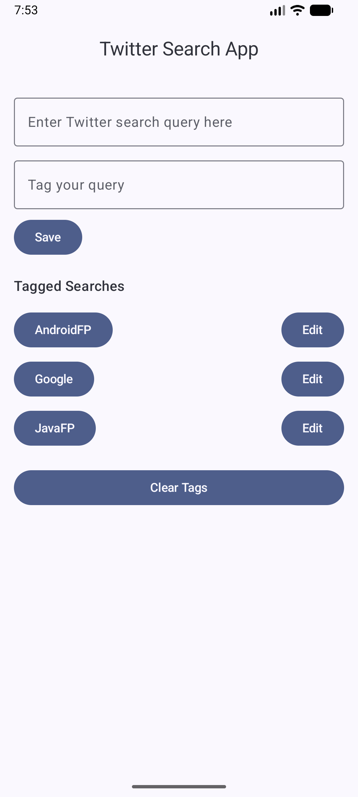
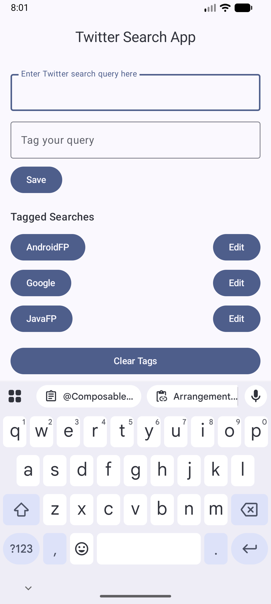
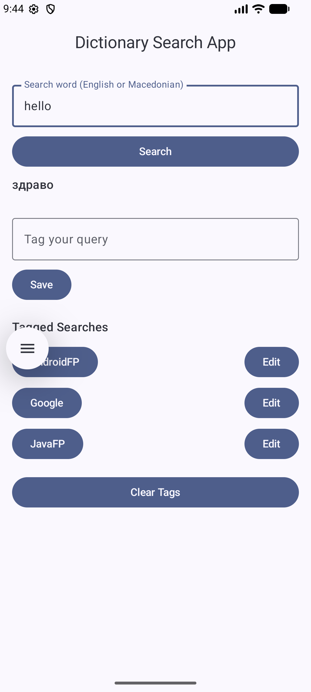
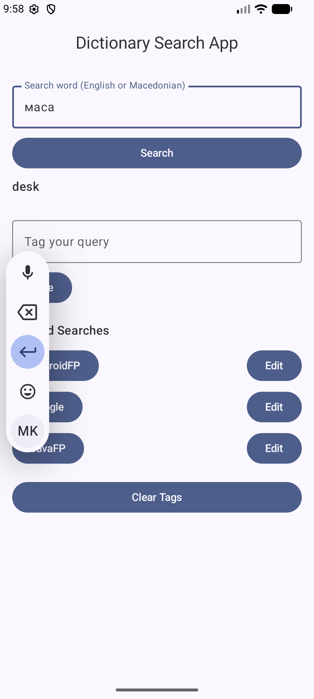
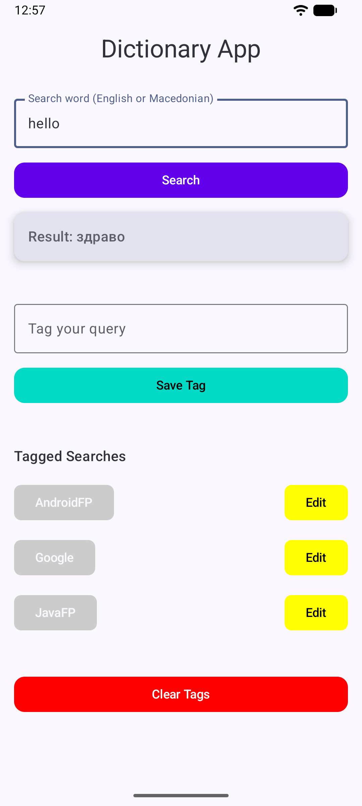

# Twitter Search App

Android application built with Jetpack Compose and Material 3.

This project was created for the course **Programming for Mobile Platforms**.

## Homework 1

Implementation of a UI screen for managing tagged searches.

### Features

* Add search tags
* Edit button (UI)
* Clear all tags
* Built using Jetpack Compose components (Scaffold, LazyColumn, Material 3)

### Screenshots




---

## Homework 2

Extension of the previous project with **dictionary search functionality**.

The application reads data from a **text file dictionary** and allows searching words in **English and Macedonian**.

Example dictionary entries:

```
sample, пример
morning, утро
hello, здраво
trousers, пантолони
father, татко
desk, маса
chair, столица
```

### Features

* Read dictionary from a text file (`dictionary.txt`)
* Search word in **English → Macedonian**
* Search word in **Macedonian → English**
* Display translation if the word exists
* Show message if the word is not found

### Screenshots





---

## Homework 4 – Jetpack Compose

Implemented basic Jetpack Compose examples:

- Counter App (state management)
- Layout example (Row & Column)

Updated Dictionary App UI using Compose:
- Improved layout
- Material 3 components
- Better user interface

### Screenshots

#### Counter App


#### Dictionary App


---

## Technologies

* Kotlin
* Jetpack Compose
* Material 3
* Android Studio
* Text file dictionary

---

## Author

Jovana Rusomarovska
